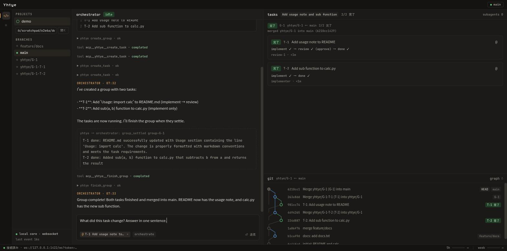
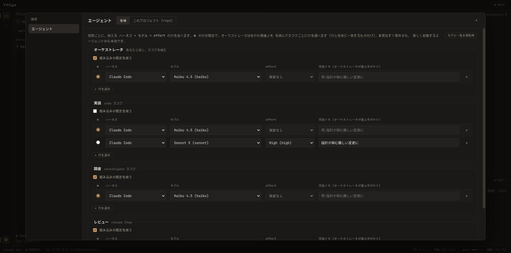

# Yhtye

A desktop client that runs several coding agents through an orchestrator.

You do not instruct individual agents. You ask the orchestrator in natural language; it splits the work
into tasks, dispatches them to sub-agents and reports the result. When a task goes wrong, it is reported
right away instead of after the whole group finishes, and the orchestrator itself steps in to deal with it.

Japanese: [README.md](README.md)





The UI text and most of the documentation are in Japanese.

## Status

An early, personal project (v0.1). There are no prebuilt binaries or releases yet; you build from source.

What works:

- Open a project (a git repository), send the orchestrator a request, and it splits the work into a group of
  tasks; sub-agents implement them in git worktrees, review, and the result is merged into the base branch.
- Per-role harness / model / effort settings (orchestrator, implementation, investigation, review), globally
  and per project.
- Harnesses: Claude Code, OpenCode, Codex (with the OpenRouter model list), Devin (basic operation verified against the
  real Devin on the free plan), MiniMax Code (basic operation verified against mcode 0.6.2), Google Antigravity (only
  startup and the logged-out failure verified against the real server), and Grok Build (basic operation verified against grok 1.0.46). A harness is offered only when its executables (`npx` / `opencode` / `codex` / `devin` / `mcode` / `agy_acp_server.par` / `grok`) are found on
  `PATH` or in `~/.local/bin` etc. (`mcode` is also looked for in `~/.minimax-code/bin`, `agy_acp_server.par` in `~/.local/share/agy-acp-server` and a few more, `grok` in `~/.grok/bin`); the settings' "ハーネス" (Harnesses) tab shows the detection state, takes a manual
  path, and detects again.
- Resuming interrupted tasks, cancelling tasks, and the orchestrator handling problems such as merge conflicts.
- Secret environment variables (API keys), stored in the OS keyring.

What is not done, and limitations:

- Linux only (see below). No installers, no auto-update.
- The history ("runs") view is on hold and shows an empty state.
- Codex cannot be the orchestrator
  ([codex#13746](https://github.com/openai/codex/issues/13746)); it works as implementer / reviewer.
- Codex has only been verified with OpenRouter.
- Devin (`devin acp`) has been verified against the real Devin on the free plan (SWE-1.6 Slow): startup, the Yhtye MCP
  connection, and an implementer task completing through `report_step_done`. The logged-out error, `session/load` and
  cancellation are still unverified. If it does not work, the measured results and the manual verification checklist in [`docs/architecture/acp-harnesses.md`](docs/architecture/acp-harnesses.md) §10 (Japanese)
  is the place to start.
- MiniMax Code (`mcode acp`) has been verified against mcode 0.6.2: startup, the model list, setting the model and effort,
  and one prompt (only a few were sent). On the default `auto`, shell writes and deletes outside the working directory
  raised no permission request on the real mcode, so the automatic "allow once" answer is unverified against the real agent
  (requests do arrive when `permissionMode` is `default`). An implementer task through the Yhtye MCP and resuming are also
  unverified ([`docs/architecture/acp-harnesses.md`](docs/architecture/acp-harnesses.md) §11, Japanese). Yhtye never changes `permissionMode`: setting it writes to your global
  MiniMax settings.
- Google Antigravity (Google's official ACP server `agy_acp_server`, v1.3.0) has been verified against the real server only as far as
  startup, the logged-out failure, and (in an isolated environment with a dummy API key) the model list (14 models) and setting the model, from Yhtye's ACP layer. **Logging in with a Google
  account and sending prompts were not tried** (the login is written to your `~/.gemini`, and prompts use your quota); behaviour after login
  (streaming, permission requests, MCP, resuming) is unverified. Yhtye does not log in for you and the server has no terminal login:
  see [`SETUP.md`](SETUP.md) (Japanese) for writing `auth.type` into its `settings.json`. Whether Antigravity's terms of use allow third-party
  clients was not checked; check before using it ([`docs/architecture/acp-harnesses.md`](docs/architecture/acp-harnesses.md) §13, Japanese).
- Grok Build (`grok agent --no-leader stdio`) has been verified against grok 1.0.46 on the grok.com Free plan (`grok-4.7`):
  startup, the model list, setting the model and effort, and an implementer task completing through `report_step_done`
  (only two prompts were sent). Answering permission requests, the orchestrator role, the logged-out error and resuming
  are unverified ([`docs/architecture/acp-harnesses.md`](docs/architecture/acp-harnesses.md) §12, Japanese).

The staged plan and results are in [`docs/PLAN.md`](docs/PLAN.md) (Japanese).

## Supported platforms

- **Linux only.** Tested on Arch / CachyOS (Wayland) only; other distributions are untested.
- macOS is untested.
- Windows is not supported: agent process management relies on Unix process groups
  ([`crates/yhtye-core/src/acp/process.rs`](crates/yhtye-core/src/acp/process.rs)).

## Warnings

- Agents run code and shell commands in worktrees of your repository without asking for permission, and Yhtye
  **merges the result into your base branch**. Back up or push before trying it on a repository you care about.
- Agents run without permission prompts (Claude Code with `bypassPermissions`-equivalent, Codex with
  `agent-full-access`, Devin with `bypass`; MiniMax Code runs on mcode's own default `auto`: writes inside the working
  directory and MCP need no confirmation, and on the real mcode so did shell writes and deletes outside it; Google
  Antigravity stays in its `default` mode (unverified against the real server); Grok Build has no modes and follows the
  permission setting of your `~/.grok/config.toml`; a confirmation that does arrive is answered "allow once"
  automatically). There is no sandbox.
- Claude Code, OpenCode, Codex (OpenRouter), Devin, MiniMax Code, Google Antigravity and Grok Build usage is billed to you, or counted against your quota, by
  those services. Yhtye does not manage billing.
- Secret environment variable values are stored only in the OS keyring (Secret Service etc.); Yhtye's database
  keeps only the names. A registered variable is passed to **every** agent.

## Getting started

Details are in [`SETUP.md`](SETUP.md) (Japanese). The essentials:

1. Prerequisites (Linux): WebKitGTK 4.1, git, Node 22+ (with `npx`), Rust 1.98+, pnpm 11+.
   - Arch: `sudo pacman -S --needed webkit2gtk-4.1 base-devel curl wget file openssl appmenu-gtk-module libappindicator-gtk3 librsvg`
   - Debian / Ubuntu (package names copied from CI, otherwise untested): `build-essential pkg-config libdbus-1-dev libwebkit2gtk-4.1-dev libjavascriptcoregtk-4.1-dev libsoup-3.0-dev libayatana-appindicator3-dev librsvg2-dev`
2. Log in to the agents you want, before starting Yhtye:

   | Harness | Needs | Launched as |
   |---|---|---|
   | Claude Code | Node 22+ (`npx`) and a local Claude Code login (`~/.claude`); the `claude` CLI itself is not needed | `npx -y @agentclientprotocol/claude-agent-acp@0.84.0` |
   | OpenCode | `opencode`, logged in with `opencode auth login` | `opencode acp` |
   | Codex | `codex` and `npx`, configured in `~/.codex/config.toml` | `npx -y @agentclientprotocol/codex-acp@2.0.0` |
   | Devin (partly verified) | Devin CLI (`devin`), logged in with `devin auth login`; optionally `WINDSURF_API_KEY` | `devin acp` |
   | MiniMax Code (partly verified) | MiniMax Code CLI (`mcode`), logged in with `mcode login` | `mcode acp` |
   | Google Antigravity (startup verified only) | the ACP server zip `agy-acp-server-<version>-linux-x86_64.zip` (`agy_acp_server.par` + `localharness_external`, in one directory), signed in as described in SETUP.md | `agy_acp_server` (no arguments) |
   | Grok Build (partly verified) | Grok Build CLI (`grok`, installed to `~/.grok/bin`), logged in with `grok login` | `grok agent --no-leader stdio` |

   At least one harness is needed. Yhtye registers only the harnesses whose executables it finds: on `PATH`, then in
   `~/.local/bin`, `~/.cargo/bin`, `~/.bun/bin` and `/usr/local/bin` (`mcode` is also looked for in `~/.minimax-code/bin`,
   or `$MCODE_INSTALL_ROOT/bin`; `agy_acp_server.par`, or `agy_acp_server`, in `$AGY_ACP_SERVER_HOME`, `~/.local/share/agy-acp-server`
   and `~/.gemini/antigravity-acp/bin`; `grok` in `~/.grok/bin`, or `$GROK_HOME/bin`). Claude Code is registered when `npx` is found; the
   others are optional. If you installed something elsewhere, or after starting Yhtye, open the settings' "ハーネス" tab
   to see what was found, give an absolute path by hand, and press "再検出" (detect again); no restart is needed.
   If your Codex config gets its OpenRouter key from an environment variable, register that variable under
   "Secret environment variables" in the settings (needs a running Secret Service such as gnome-keyring or KeePassXC).
3. Build and run:

   ```sh
   git clone https://github.com/Tom039224/yhtye.git
   cd yhtye
   pnpm install
   pnpm tauri build          # binary: target/release/yhtye (add --no-bundle to skip deb/rpm/AppImage)
   # or, without building a release: pnpm tauri dev
   ```
4. In the app: enter a git repository path and open it, pick harness / model per role with the gear icon
   (the built-in default is Claude Code with the model from `YHTYE_MODEL`, `haiku` if unset), and send a request
   to the orchestrator. Tasks work in worktrees outside your repository under the data directory
   (`~/.local/share/io.github.tom039224.yhtye`, or `YHTYE_DATA_DIR`).

## Development

Prerequisites, run commands, the browser dev bridge, the Wayland + NVIDIA workaround and the build/verify
commands are in [`docs/DEVELOPMENT.md`](docs/DEVELOPMENT.md) (Japanese).

```sh
pnpm install
pnpm tauri dev
```

If a data directory from the old identifier `com.tom039224.yhtye` exists, it is moved automatically on
first start.

## Documentation

| Path | Contents |
|---|---|
| [`SETUP.md`](SETUP.md) | Setup for users (Japanese) |
| [`docs/DEVELOPMENT.md`](docs/DEVELOPMENT.md) | Development guide (Japanese) |
| [`docs/PLAN.md`](docs/PLAN.md) | Staged plan, progress, open questions |
| [`docs/architecture/`](docs/architecture/) | Orchestration model, MCP tools, core design, ACP harnesses |
| [`docs/design/`](docs/design/) | Screen spec, design tokens, snapshot of the original Claude Design |
| [`docs/adr/`](docs/adr/) | Architecture decision records |
| [`docs/e2e/`](docs/e2e/) | Screenshots from real-agent verification of each stage |
| [`docs/rebuild-summary.md`](docs/rebuild-summary.md) | Summary of the rebuild |
| [`docs/planned/`](docs/planned/) | Planned features |

The UI design originated in Claude Design; the original and the spec are in [`docs/design/`](docs/design/).

## License

BSD-3-Clause. See [`LICENSE`](LICENSE).

Author: Kirsikka (GitHub: [Tom039224](https://github.com/Tom039224))
